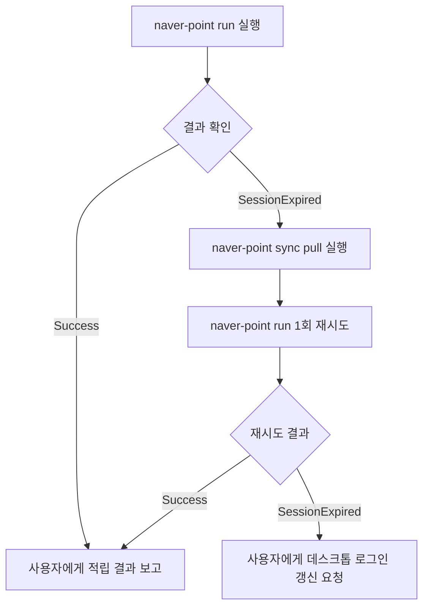

# Naver Point Picker Skill

네이버페이(Naver Pay) 혜택 페이지의 적립 포인트 버튼을 자동으로 클릭하고, 캠페인 페이지의 랜덤 포인트 카드를 순차적으로 뽑아 네이버 포인트를 자동 수집하는 에이전트 스킬입니다.

---

## 🚫 1. Agent Role & Boundary (에이전트 권한 및 제약 사항)

에이전트는 비대화형(Headless) 환경에서 안전하고 신속하게 작업을 수행해야 합니다:
- **허용된 명령어**: `naver-point run`, `naver-point balance`, `naver-point status`, `naver-point sync pull`, `naver-point logout`
- **에이전트 실행 금지 명령어**:
  - `naver-point login`: 사용자 GUI 화면 개입이 필요하므로 에이전트가 직접 실행하지 않습니다.
  - `naver-point sync push`: 세션 업로드는 수동 로그인 직후에만 실행되므로 에이전트가 임의로 호출하지 않습니다.
- **필수 플래그**: 기계 판독과 백그라운드 구동을 위해 모든 명령어 호출 시 반드시 `--headless --json`을 기본 전달합니다.

---

## 🚀 2. Execution Commands (실행 명령어 규격)

사용자의 요청 맥락에 따라 적절한 명령어를 호출합니다:

### 1) 기본 전체 포인트 수집 (혜택 클릭 + 랜덤 뽑기)
```bash
naver-point run --headless --json
```

### 2) 특정 작업만 선별 실행
- **혜택 페이지만 수집**:
  ```bash
  naver-point run --headless --json --benefit-only
  ```
- **랜덤 카드 뽑기만 수집**:
  ```bash
  naver-point run --headless --json --draw-only
  ```
- **모의 실행 (수집 대상 요소만 스캔)**:
  ```bash
  naver-point run --headless --json --dry-run
  ```

### 3) 포인트 잔액 및 세션 상태 확인
- **현재 포인트 잔액 조회**:
  ```bash
  naver-point balance --headless --json
  ```
- **세션 유효성 점검**:
  ```bash
  naver-point status --json
  ```

> [!TIP]
> 만약 `naver-point` 명령어가 PATH에 없다면 도구 디렉토리 내의 래퍼 스크립트를 직접 호출할 수 있습니다:
> `tools/naver-point/src/naver-point.sh run --headless --json`

---

## 🔄 3. Self-Healing & Session Recovery (세션 자가 치유 프로토콜)

세션 만료(`status: SessionExpired`)가 감지되었을 때 에이전트는 당황하거나 즉시 실패 보고를 하지 않고, **자율 복구 시퀀스**를 수행해야 합니다:



1. **만료 감지 (`status: SessionExpired`)**:
   - Google Drive에 다른 데스크톱 PC(Mac 등)에서 새로 갱신된 최신 세션이 업로드되어 있을 수 있습니다.
   - 즉시 클라우드 동기화 다운로드를 실행합니다:
     ```bash
     naver-point sync pull --json
     ```
2. **단 1회 재실행 (Retry Once)**:
   - `sync pull` 완료 후 원래 요청받았던 `run` 명령을 1회 재시도합니다.
3. **최종 실패 시 에스컬레이션**:
   - 재시도 후에도 여전히 `SessionExpired`가 반환되면 루프를 중단하고, 사용자에게 명확한 조치 방법을 안내합니다:
     > *"네이버 로그인 세션이 만료되었습니다. 데스크톱(Mac/PC) 터미널에서 `naver-point login`을 실행하여 1회 로그인해 주시면 Google Drive를 통해 홈서버로 자동 동기화됩니다."*

---

## 📊 4. Output Specification & Reporting (보고 지침)

### 표준 출력 규격 (stdout JSON)
- **수집 성공 시 (`status: Success`)**:
  ```json
  {
    "status": "Success",
    "benefit_clicked": 4,
    "random_draws": 2,
    "starting_balance": 14200,
    "ending_balance": 14225,
    "earned_points": 25,
    "session_synced": true
  }
  ```
- **잔액 조회 성공 시 (`status: Success`)**:
  ```json
  {
    "status": "Success",
    "balance": 14225
  }
  ```
- **세션 만료 시 (`status: SessionExpired`)**:
  ```json
  {
    "status": "SessionExpired",
    "error_message": "네이버 로그인 세션이 만료되었습니다. 'naver-point login'을 실행해 주세요."
  }
  ```
- **실패 시 (`status: Fail`)**:
  ```json
  {
    "status": "Fail",
    "error_message": "Network timeout while loading campaign page",
    "screenshot_path": "logs/error_screenshot.png"
  }
  ```

### 사용자 보고 템플릿
- **포인트 수집 성공 시**:
  - 친절하고 명확한 1~2줄 요약으로 실제 획득 포인트와 잔액을 강조하여 보고합니다:
  - *예시: "🎉 네이버 포인트 수집 완료! 혜택 4건 클릭 및 랜덤 뽑기 2회를 통해 총 **+25P**가 적립되었습니다. (현재 보유 잔액: **14,225P**)"*
- **잔액 조회 요청 시**:
  - *예시: "💰 현재 보유하신 네이버페이 포인트는 **14,225P**입니다."*
- **자가 치유 실패 후 세션 만료 안내 시**:
  - *예시: "⚠️ 네이버 로그인 세션이 만료되었습니다. 클라우드에서 세션 갱신을 시도했으나 유효한 세션이 없습니다. 데스크톱(Mac/PC) 터미널에서 `naver-point login`을 실행해 주시면 자동으로 동기화됩니다."*
- **기타 에러 시**:
  - 원인 에러 메시지와 함께 진단용 스크린샷(`screenshot_path`)이 보존되었음을 간결히 알리고 재시도를 권유합니다.
